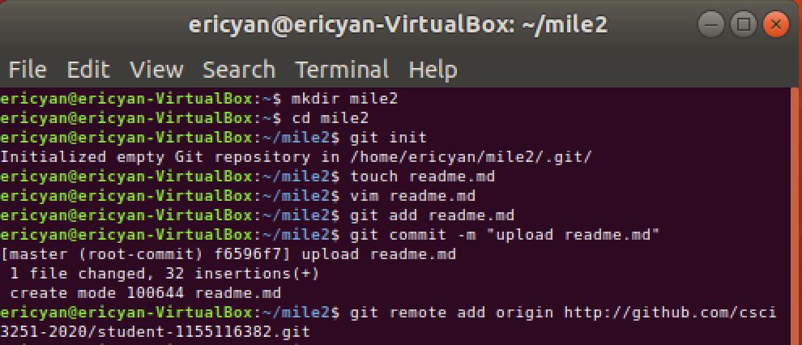

## Somthing about me

Hello, My name is Yan Chun Hung,Eric.
I am a year 3 CE student.
I love Maths.

## Programming Language:

- C
- C++
- Java
- Python
- VHDL

## Course I taken this semster:
|   Code   |                  Name                    | Credits |
|----------|------------------------------------------|---------|
| CENG3410 | Smart Hardware Design                    |    3    |
| CENG3430 | Rapid Prototyping of Digital Systems     |    3    |
| CSCI3250 | Computers and Society                    |    2    |
| CSCI3251 | Engineering Practicum                    |    1    |
| ELTU3014 | English for Engineering Students II      |    3    |
| ENGG2430 | Probability and Statistics for Engineers |    3    |

## Project Milestones that have been done

- [x] Milestone 1
- [ ] Milestone 2
- [ ] Milestone 3

## Screenshot:

